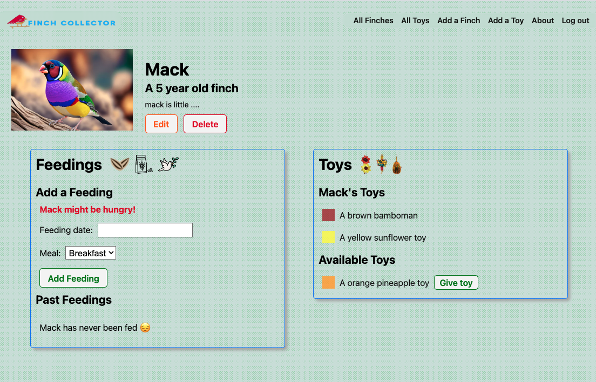

# Finch Collector

*** 
### `Description:`
##### 

Finch Collector is an app for finch lovers! You can add a variety of finches to your virtual aviary, feed them, and give them toys to keep them happy and healthy.

***

# [Use Finch Collector 👈](https://finch-collector-kb.fly.dev/) 
***

### `Technologies `

|Fly.io   | Neon | 
|:-------:| -----:|

***
# 'Credits 🙌'
* Finch images from [here](https://stock.adobe.com/search?k=finch)
* Finch toy images from [here](https://www.pngwing.com/en/search?q=birds+Toys)

***
### `Ice Box🧊`
- [] AAU, I want to be able to add images along with the finch.
- [] AAU, I should be able to search for a a finch.
- [] AAU, I should be able to use my phone to collect finches.